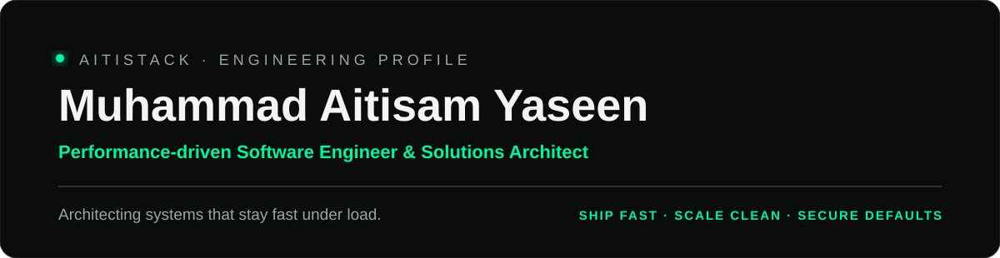
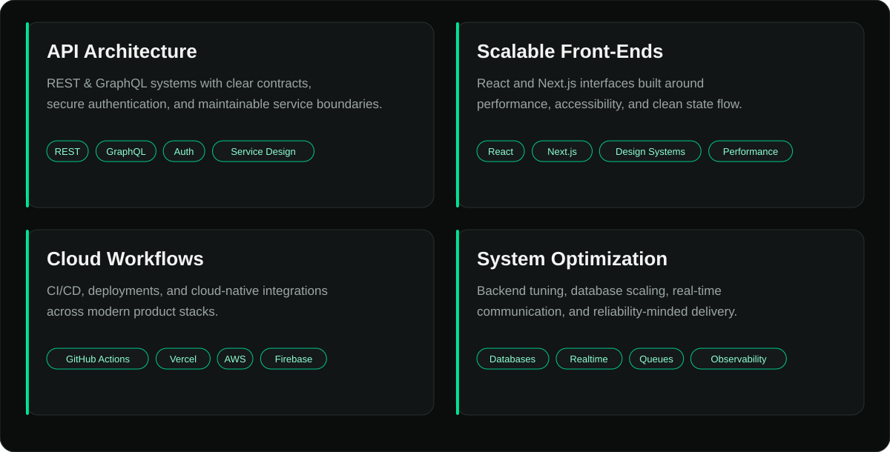
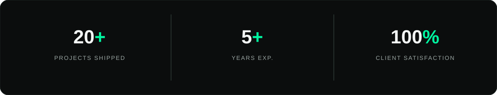
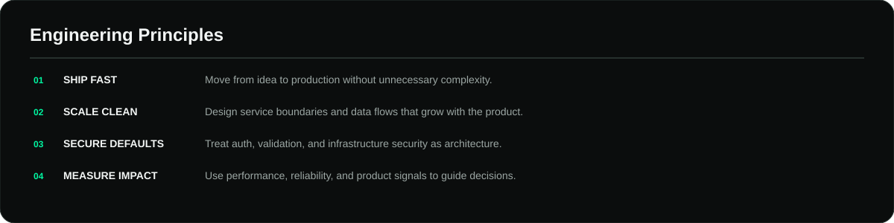
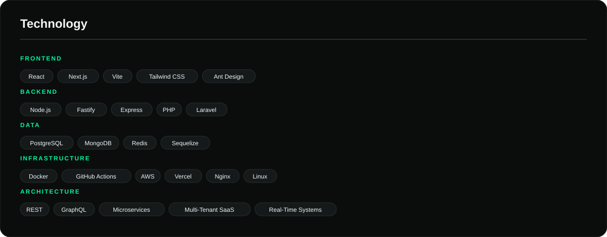
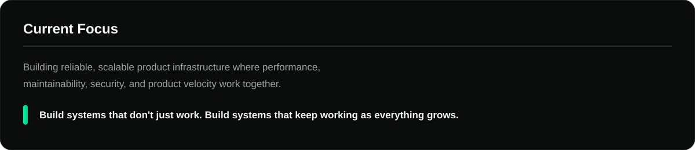

 

 

## About Me

Performance-driven Software Engineer and Solutions Architect with **5+ years** architecting, scaling, and maintaining complex web, mobile, and cloud-based systems.

Specialized in backend optimization, database scaling, real-time communication architectures, and secure cloud workflows across modern JavaScript and PHP ecosystems.

> **AY · NOW TRANSMITTING**
>
> Architecting systems that stay fast under load.
>
> `Remote-first` · `Backend-strong` · `Product-minded`

---

---

## What We Build

<table width="100%">
<tr>
<td width="50%" valign="top">

### Backend & APIs

- REST APIs
- GraphQL APIs
- Authentication & authorization
- Microservice architectures
- Real-time systems
- Queue-driven workflows
- Database architecture
- Performance optimization

</td>
<td width="50%" valign="top">

### Frontend & Products

- React applications
- Next.js applications
- Responsive product interfaces
- Design systems
- State management
- Progressive Web Apps
- Mobile-ready experiences
- Performance-focused UI

</td>
</tr>
<tr>
<td width="50%" valign="top">

### Cloud & DevOps

- CI/CD pipelines
- Dockerized deployments
- VPS infrastructure
- Cloud-native workflows
- GitHub Actions
- AWS integrations
- Vercel deployments
- Reverse proxies & SSL

</td>
<td width="50%" valign="top">

### Data & Reliability

- PostgreSQL
- MongoDB
- Redis-compatible systems
- Database scaling
- Caching strategies
- Observability
- Fault-aware architecture
- Secure infrastructure

</td>
</tr>
</table>

---

---

  

### Let's Build Something That Scales.

[GitHub](https://github.com/aitistack) · [LinkedIn](https://www.linkedin.com/)

<!--
Design system:
Background: #0B0D0D
Panel: #121515
Border: #26302D
Text: #F2F5F4
Muted: #9BA6A3
Accent: #00F5A0
Accent 2: #00C98A

GitHub strips inline CSS, style tags, classes, and IDs from rendered Markdown.
The visual system above is therefore implemented through repository-local SVG assets,
while the semantic content remains in Markdown/HTML for accessibility and indexing.
-->
